### 09011182328003_Ayudiah Az-zahra_SK3C
## 50 COMMAND LINE
# 1. Whoami

Whoami berfungsi ketika menjalankan perintah, sistem akan menampilkan nama pengguna yang sedang digunakan

#   2.    Sudo su

Mengalihkan ke Akses Root. Ketika  menjalankan sudo su, akan beralih dari pengguna saat ini ke pengguna root tanpa perlu memasukkan kata sandi root. Ini memberikan akses penuh ke sistem.

#      3.   Apt Updates

  
   Untuk menyegarkan data paket, mengelola repository, persiapan untuk instalisasi dan pembaruan

  # 4.    Apt Upgrades

   
       
        Perintah apt upgrade pada Linux Mint digunakan untuk mengupgrade paket-paket perangkat lunak yang terinstal di sistem Anda ke versi terbaru yang tersedia di repositori.
  # 5. ls

  

  Perintah ls di Linux Mint, termasuk saat digunakan di dalam VirtualBox, adalah perintah dasar yang digunakan untuk menampilkan daftar file dan direktori dalam sebuah direktori.

  #   6.     cd Desktop
  

Perintah cd Desktop di Linux Mint yang berjalan di VirtualBox digunakan untuk mengubah direktori    kerja saat ini ke direktori "Desktop" pengguna.

  #  7.  mkdir Testing
  
 

Perintah mkdir digunakan untuk membuat direktori (folder) baru di sistem file Linux. Jika Anda menjalankan perintah ini di terminal Linux Mint yang berjalan di VirtualBox, Anda dapat membuat direktori baru sesuai dengan kebutuhan Anda.

  #  8. touch index.js
  

Perintah ini membuat file baru dan memperbarui timestamp.

# 9.  ll

Perintah ini menampilkan daftar file dan direktori di dalam direktori saat ini dengan informasi detail, seperti izin file, jumlah link, pemilik, grup, ukuran file, tanggal modifikasi, dan nama file atau direktori.

# 10. clear

Perintah ini menampilkan daftar file dan direktori di dalam direktori saat ini dengan informasi detail, seperti izin file, jumlah link, pemilik, grup, ukuran file, tanggal modifikasi, dan nama file atau direktori.
       
 # 11. cp –r

Perintah cp -r di Linux, termasuk di Linux Mint yang berjalan di VirtualBox, digunakan untuk menyalin direktori beserta seluruh isinya.
        
  # 12. rm –rf

Perintah rm -rf di Linux, termasuk pada sistem operasi Linux Mint yang berjalan di VirtualBox, adalah perintah yang sangat kuat dan sering digunakan dengan hati-hati.
        
  # 13. cd

Perintah cd (change directory) di Linux Mint (atau sistem operasi berbasis Unix/Linux lainnya) digunakan untuk berpindah antara direktori di terminal.
          
   # 14. date

Perintah date di Linux Mint (atau di sistem Linux lainnya) digunakan untuk menampilkan dan mengatur tanggal serta waktu sistem.
   # 15. uname

Perintah uname di Linux Mint (atau distribusi Linux lainnya) digunakan untuk menampilkan informasi tentang sistem operasi dan kernel yang sedang berjalan.

 # 16. nano test 1

nano adalah editor teks berbasis terminal yang sering digunakan di Linux, termasuk di Linux Mint yang berjalan di VirtualBox.
 # 17. route –n

Perintah route -n di Linux Mint (atau distribusi Linux lainnya) digunakan untuk menampilkan tabel routing jaringan tanpa melakukan resolusi nama host.

# 18. ifconfig

Perintah ifconfig di Linux digunakan untuk menampilkan atau mengkonfigurasi antarmuka jaringan pada sistem
 
 # 19. netstat –tuln

Perintah netstat -tuln di Linux digunakan untuk menampilkan informasi tentang koneksi jaringan dan port yang sedang digunakan. 

# 20. pwd 

Fungsi utama perintah ini adalah menampilkan direktori saat ini di mana Anda berada dalam terminal. Ini berguna untuk mengetahui lokasi direktori aktif Anda saat ini.

# 21. echo 

Perintah echo di Linux Mint, seperti pada umumnya di sistem Linux, digunakan untuk menampilkan pesan atau output ke terminal

# 22. uname –n

Perintah uname -n di Linux digunakan untuk menampilkan nama host dari sistem operasi. Nama host adalah nama unik yang diberikan kepada komputer di jaringan

# 23. uname -r

Perintah uname -r di Linux Mint, seperti pada sistem Linux lainnya, digunakan untuk menampilkan informasi tentang versi kernel Linux yang sedang berjalan.

# 24. uname –m

 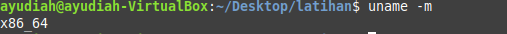

Perintah uname -m di Linux digunakan untuk menampilkan informasi tentang arsitektur mesin (hardware architecture) dari sistem operasi yang sedang berjalan. Ketika Anda menjalankan uname -m di terminal Linux Mint yang berjalan di VirtualBox, outputnya akan menunjukkan tipe arsitektur prosesor yang digunakan oleh sistem

# 25. df –h

Perintah df -h di Linux Mint (atau di sistem Linux lainnya) digunakan untuk menampilkan informasi tentang penggunaan disk dari sistem file yang dipasang.
# 26. history

Fungsi history di terminal Linux, termasuk Linux Mint yang berjalan di VirtualBox, adalah untuk menampilkan daftar perintah-perintah yang telah Anda jalankan sebelumnya di terminal.

# 27. ps aux

Perintah ps aux di Linux Mint (atau distribusi Linux lainnya) digunakan untuk menampilkan daftar semua proses yang sedang berjalan di sistem, lengkap dengan detail mengenai masing-masing proses.

# 28. free –h 

Perintah free -h di Linux Mint (atau distribusi Linux lainnya) digunakan untuk menampilkan informasi tentang penggunaan memori sistem dalam format yang lebih mudah dibaca oleh manusia.

# 29. df –i

Perintah df di Linux digunakan untuk menampilkan informasi tentang ruang disk yang tersedia di sistem file.

# 30. hostname 

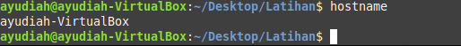

Perintah hostname di Linux Mint, termasuk yang berjalan di VirtualBox, digunakan untuk menampilkan atau mengatur nama host (hostname) sistem.
# 31. passwd

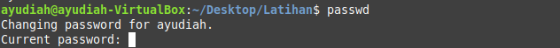

Perintah passwd di Linux Mint, maupun di distribusi Linux lainnya, digunakan untuk mengubah kata sandi (password) pengguna.

# 32. uptime

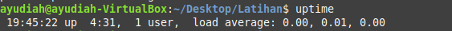

Perintah uptime di Linux Mint (atau di distribusi Linux lainnya) digunakan untuk menampilkan berapa lama sistem telah berjalan sejak terakhir kali dinyalakan, serta informasi tambahan tentang jumlah pengguna yang saat ini login dan beban sistem.

# 33. hostnamectl

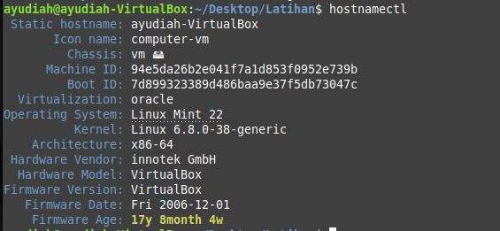

Perintah hostnamectl di Linux Mint (dan distribusi Linux lainnya yang menggunakan systemd) digunakan untuk mengelola dan menampilkan informasi terkait nama host (hostname) sistem.

# 34. free 

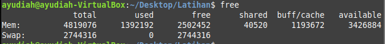

Di Linux Mint yang berjalan di VirtualBox, perintah free digunakan untuk menampilkan informasi tentang penggunaan memori sistem.

# 35. cat 

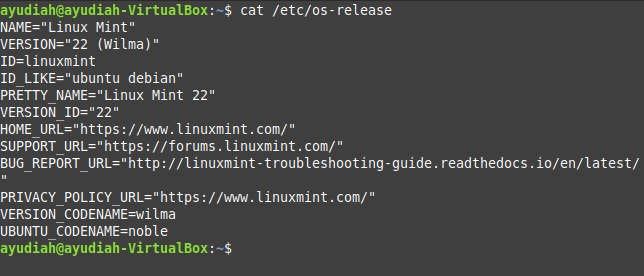

Perintah cat di Linux Mint, termasuk di lingkungan VirtualBox, adalah singkatan dari "concatenate" (menggabungkan). Perintah ini digunakan untuk menampilkan, menggabungkan, dan membuat file teks

# 36. find 
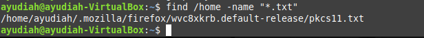
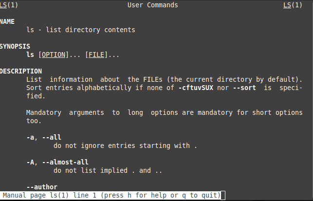

Perintah find di Linux Mint (atau sistem berbasis Unix lainnya) adalah alat yang sangat kuat dan fleksibel yang digunakan untuk mencari file dan direktori di dalam sistem file. Anda dapat mencari berdasarkan nama, tipe, ukuran, waktu modifikasi, dan banyak kriteria lainnya.
 # 37. file 

 

File VirtualBox dengan Linux Mint adalah sebuah mesin virtual yang berfungsi sebagai lingkungan terisolasi untuk menjalankan sistem operasi Linux Mint di dalam komputer Anda, tanpa perlu menginstalnya secara langsung pada hard drive

# 38. id 

 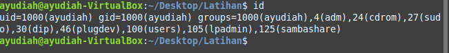

Perintah id di Linux, termasuk pada sistem yang berjalan di VirtualBox seperti Linux Mint, digunakan untuk menampilkan informasi terkait pengguna saat ini, termasuk User ID (UID), Group ID (GID), dan grup tambahan yang menjadi anggota pengguna tersebut.

# 39. ps 

 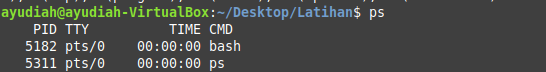

 Perintah ps di Linux Mint (atau sistem Linux lainnya) adalah singkatan dari "process status" dan digunakan untuk menampilkan informasi tentang proses yang sedang berjalan di sistem

# 40. whatis mkdir 

 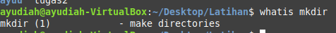

 Perintah whatis digunakan di terminal Linux untuk memberikan deskripsi singkat tentang perintah atau program tertentu. Jika Anda menggunakan whatis dengan perintah mkdir di VirtualBox yang menjalankan Linux Mint, ini akan memberikan informasi singkat tentang fungsi perintah mkdir

# 41. date + "%Y + %m -%d"

 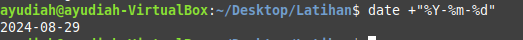

Perintah date di Linux digunakan untuk menampilkan tanggal dan waktu saat ini. Dengan menggunakan format string, Anda dapat mengatur tampilan tanggal dan waktu sesuai dengan kebutuhan Anda

# 42. nano 

 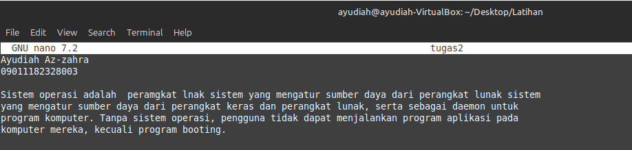

nano adalah editor teks berbasis terminal yang sangat sederhana dan mudah digunakan di Linux, termasuk di distribusi Linux Mint yang berjalan di VirtualBox

# 43. less

 

 Perintah less di Linux Mint (atau distribusi Linux lainnya) adalah utilitas yang digunakan untuk melihat isi dari file teks dengan cara yang lebih interaktif dan nyaman dibandingkan dengan perintah seperti cat.

# 44. head 

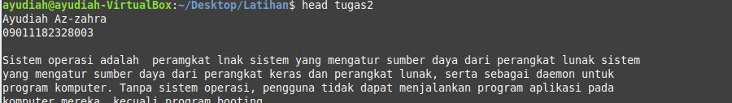

Di Linux Mint (dan umumnya di sistem Linux lainnya), perintah head digunakan untuk menampilkan beberapa baris pertama dari sebuah file teks di terminal. Secara default, head menampilkan 10 baris pertama dari file, tetapi jumlah baris yang ditampilkan dapat diubah dengan opsi yang tersedia.

# 45. stat 

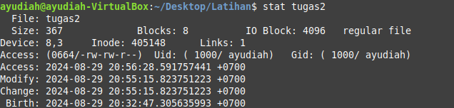

Perintah stat di Linux Mint (atau sistem operasi Linux lainnya) digunakan untuk menampilkan detail informasi mengenai file atau direktori. Informasi ini mencakup berbagai atribut seperti ukuran file, izin akses, waktu modifikasi terakhir, dan banyak lagi.

# 46. type ls

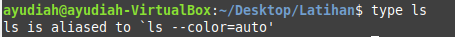

Perintah ls di Linux Mint, termasuk di VirtualBox, digunakan untuk menampilkan isi dari direktori. Ini adalah salah satu perintah dasar dalam sistem operasi berbasis UNIX/Linux dan sangat berguna untuk mengetahui file atau sub-direktori apa saja yang terdapat dalam sebuah direktori.

# 47. uname -v

Perintah uname -v di Linux digunakan untuk menampilkan versi kernel dari sistem operasi yang sedang berjalan. Di Linux Mint yang berjalan di VirtualBox, perintah ini memberikan informasi tentang versi kernel dan tanggal pembuatan kernel tersebut

# 48. rm-rf 

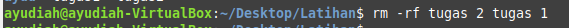

Perintah rm -rf di Linux, termasuk di Linux Mint yang berjalan di VirtualBox, adalah perintah yang digunakan untuk menghapus file dan direktori.

# 49. uname -- version

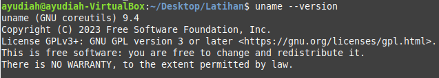

Perintah uname digunakan di Linux untuk menampilkan informasi tentang sistem operasi dan kernel yang digunakan. Namun, perintah uname tidak memiliki opsi --version. Untuk mendapatkan versi kernel, Anda dapat menggunakan opsi -r (release) dengan uname.

# 50 exit

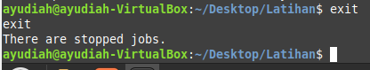

Keluar dari shell atau terminal.

 

 

